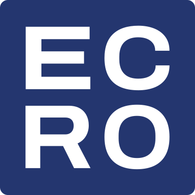

<picture>
  <source media="(prefers-color-scheme: dark)" srcset="assets/ecro-seal-dark.svg">
  
</picture>

**My name on it. A craftsman's discipline, out on the frontier.**

Eighteen years in embedded. AI and robotics are where everyone is heading now. I compete there with what most people in those fields don't carry: real hardware, and the habit of measuring it.

One standard for everything I build: if you use it, you should end up measurably ahead of someone using the usual tool. If I can't show that with a measurement, it isn't done.

**How I work**

1. **I build what I need first.** Every project here started as a tool I was missing.
2. **Small, never sloppy.** I cut scope down to the smallest thing that keeps the promise. I don't cut quality.
3. **My name stays on it.** What ships keeps getting fixed.
4. **Ship, then ship the fix.** One quiet launch doesn't stop me, and when something is fixed, I say so.

The open-source tools are pinned below. Two products have no public source:

- **[NeuroTerm](https://neuroterm.dev)**: serial and SSH terminal for embedded engineers. Local LLM, offline RAG, pattern markers. Bug reports go to [neuroterm-issues](https://github.com/Ecro/neuroterm-issues).
- **SpotOn**: tennis impact sensor. nRF54L15 and ICM-42688-P at 1 kHz on Zephyr. Boards are in fab.

**Lab notes** at [edgelog.dev](https://edgelog.dev): measurements, wrong turns, and the part numbers behind them. [RSS](https://edgelog.dev/rss.xml)

If something I made saved you time, tell me in an issue or at contact@edgelog.dev. Those notes decide what I fix next.
